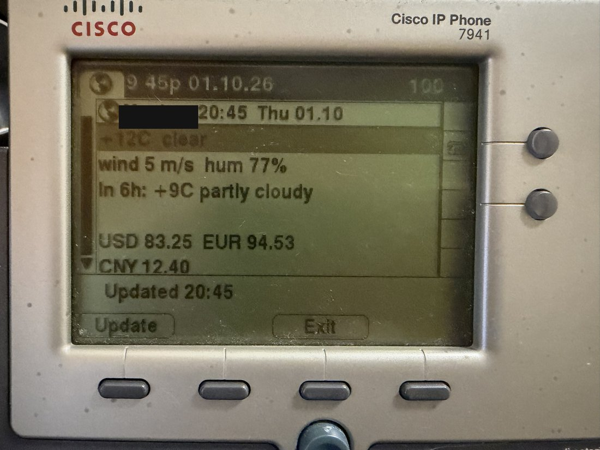
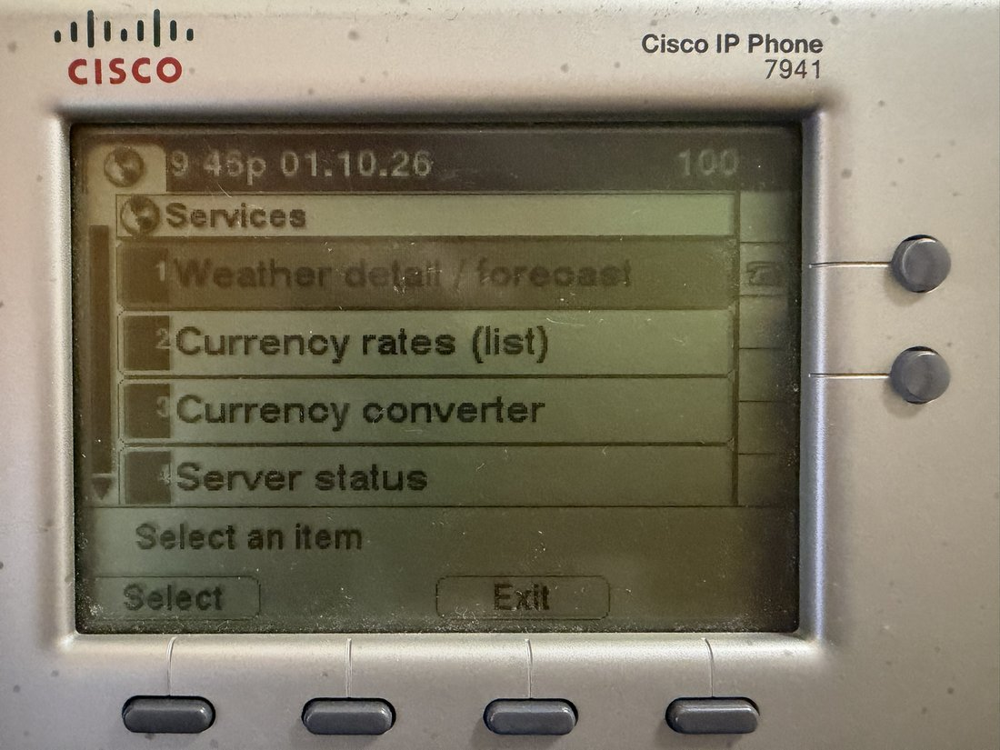
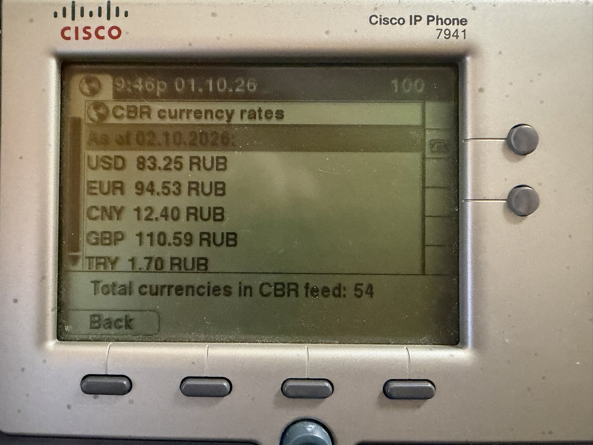
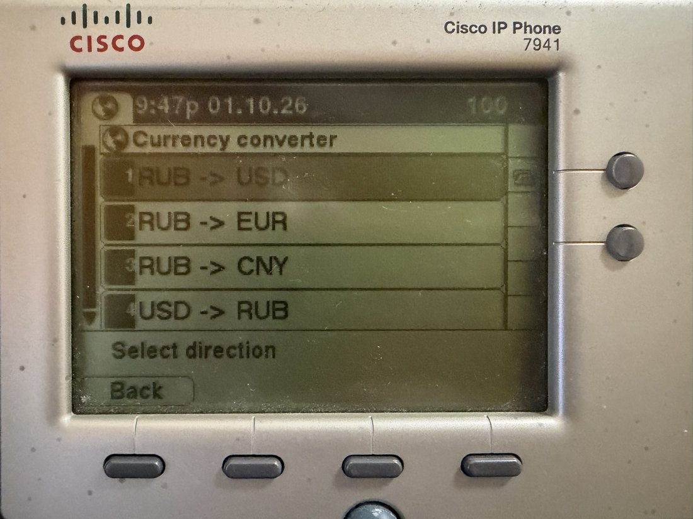

# cisco-7941-messenger-bridge

[Читать на русском](#русский)

Turns an old Cisco 7941 IP phone into a little desk dashboard: idle-screen
weather and exchange rates, plus a "Services" menu (hard key on the phone)
with a detailed forecast, a currency rates list, a currency converter you
type an amount into with the keypad, and basic infrastructure status.

It runs entirely on your own SIP server -- no cloud service, no CUCM license,
no Cisco account needed. The phone just talks SIP to [Asterisk](https://www.asterisk.org/)
and fetches its screens as Cisco's own push-XML format
(`CiscoIPPhoneText` / `CiscoIPPhoneMenu` / `CiscoIPPhoneInput`) from a small
Python HTTP service.

## What it looks like on the phone

- **Idle screen** (always on, refreshes every minute): time/date, current
  weather, a couple of exchange rates.
- **Services menu** (Services hard key):
  - Weather detail / forecast -- current conditions + next few days
  - Currency rates (list) -- a longer list of CBR exchange rates
  - Currency converter -- pick a direction (e.g. RUB -> USD), type an
    amount on the keypad, get the converted value
  - Server status -- uptime / SIP registration state of the local host,
    plus (optionally) status from any number of other servers you plug in
  - About the project

| Idle screen | Services menu |
|---|---|
|  |  |

| Currency rates | Currency converter |
|---|---|
|  |  |

## How it works

```
Cisco 7941  --TFTP-->  boot config (SEP<mac>.cnf.xml)  --tells the phone--> where to register (SIP) and where idleURL/servicesURL point

Cisco 7941  --SIP----->  Asterisk (registration only, no calling features needed)

Cisco 7941  --HTTP GET-->  phone-idle/idle.py  --parses/serves-->  CiscoIPPhoneText / Menu / Input XML
                               |
                               +--> api.met.no (weather)
                               +--> cbr.ru (exchange rates)
                               +--> local Asterisk status file (written by astatus.py)
                               +--> optional: any number of other servers' /status
                                    endpoints (remote-status/status-agent.py)
```

## Known limitations (tested on this hardware/firmware)

- Tested against a Cisco 7941G running SIP firmware `SIP41.8-5-4S` in
  non-CUCM ("USECALLMANAGER") mode. Other 79xx models/firmware may behave
  differently.
- All push-XML screens (`CiscoIPPhoneText`/`Menu`/`Input`) are parsed as
  **ISO-8859-1 (Latin-1) only** on this firmware -- there is no non-Latin
  text support, regardless of the encoding declared in the HTTP response.
  Keep all screen text ASCII/Latin.
- `CiscoIPPhoneImage` (bitmap screens) does **not** work on this firmware:
  the phone hangs on "Requesting..." indefinitely even though the server
  responds quickly with a valid, correctly-sized payload. There's no bitmap
  fallback implemented here because of this.

## Repo layout

```
phone-idle/
  idle.py                        the HTTP service the phone talks to
  astatus.py                     root-owned helper: polls Asterisk, writes
                                  a status file idle.py can read unprivileged
  phone-idle.service.example     systemd unit template for idle.py
  phone-astatus.service.example  systemd unit template for astatus.py
remote-status/
  status-agent.py                 optional, generic: a small status endpoint
                                   you can run on ANY server (VPN box, NAS,
                                   another SIP box, whatever) -- runs a list
                                   of shell commands you configure and
                                   reports their output as display lines
  status-agent.service.example    systemd unit template for it
asterisk/
  pjsip.conf.example             minimal PJSIP config for one phone
  extensions.conf.example        minimal dialplan
tftp/
  SEP_TEMPLATE.cnf.xml           TFTP boot config template for the phone
```

Every `*.example` / `*_TEMPLATE.*` file has `{{PLACEHOLDER}}` or
`<PLACEHOLDER>` values you need to fill in -- see "Setup" below. None of the
real, filled-in configs (with your actual SIP password, IPs, MAC) are meant
to be committed; `.gitignore` already excludes the usual filenames.

## Setup

1. **Firmware**: this project does not include Cisco firmware files
   (`*.sbn`, `*.loads`) -- they're Cisco's copyrighted binaries. Source your
   own SIP firmware for your phone model and drop it in your TFTP root
   alongside the boot config.
2. **Asterisk**: copy `asterisk/pjsip.conf.example` and
   `asterisk/extensions.conf.example` into your Asterisk config, fill in
   the placeholders (server IP, a strong random SIP password), and
   `asterisk -rx "core reload"`.
3. **TFTP boot config**: copy `tftp/SEP_TEMPLATE.cnf.xml` to
   `SEP<YOUR_PHONE_MAC>.cnf.xml` (uppercase MAC, no separators) in your TFTP
   root, fill in the placeholders (must match what you put in `pjsip.conf`).
   Point your DHCP server at your TFTP server (option 66 or similar) so the
   phone finds it at boot.
4. **phone-idle service**:
   - `pip install` needs nothing beyond the Python standard library.
   - Copy `phone-idle/idle.py` and `phone-idle/astatus.py` to e.g.
     `/opt/phone-idle/` on your SIP server.
   - Copy `phone-idle.service.example` and `phone-astatus.service.example`
     to `/etc/systemd/system/`, drop the `.example` suffix, fill in the
     environment variables (at minimum `BASE_URL`, `CITY*`, `LAT`/`LON`,
     `TZ_NAME`, `MET_NO_USER_AGENT` -- [met.no asks for a descriptive User-Agent
     with contact info](https://developer.yr.no/doc/TermsOfService/)).
   - `systemctl daemon-reload && systemctl enable --now phone-astatus phone-idle`
5. **Optional: status from other servers**: the Server status screen can
   show status from *any number* of other servers, not just the one running
   `idle.py`. For each one: deploy `remote-status/status-agent.py` there
   (with `remote-status/status-agent.service.example`), configure
   `STATUS_CHECKS` with whatever shell commands make sense for that server
   (disk space, container count, VPN peer count, anything), generate a
   random token (`openssl rand -hex 32`), set it as `STATUS_TOKEN` there,
   firewall that port to the phone-idle host's IP only, and add
   `Label=http://that-host:8097/status?token=...` to `REMOTE_STATUS` on the
   phone-idle side (comma-separate multiple servers).

## License

MIT -- see [LICENSE](LICENSE).

---

## Русский

Превращает старый IP-телефон Cisco 7941 в маленькую настольную панель: на
экране ожидания -- погода и курсы валют, а в меню "Services" (аппаратная
кнопка на телефоне) -- подробный прогноз погоды, список курсов валют,
конвертер валют (сумма вводится с клавиатуры телефона) и базовый статус
инфраструктуры.

Работает полностью на собственном SIP-сервере -- без облачных сервисов,
без лицензии CUCM, без аккаунта Cisco. Телефон просто регистрируется по
SIP на [Asterisk](https://www.asterisk.org/) и получает экраны в
собственном push-XML формате Cisco (`CiscoIPPhoneText` / `CiscoIPPhoneMenu`
/ `CiscoIPPhoneInput`) от небольшого HTTP-сервиса на Python.

### Что видно на экране телефона

- **Экран ожидания** (всегда включён, обновляется раз в минуту): время/дата,
  текущая погода, пара курсов валют.
- **Меню Services** (аппаратная кнопка Services):
  - Weather detail / forecast -- текущая погода + прогноз на несколько дней
  - Currency rates (list) -- расширенный список курсов ЦБ РФ
  - Currency converter -- выбор направления (например RUB -> USD), ввод
    суммы с клавиатуры, результат конвертации
  - Server status -- аптайм / статус SIP-регистрации локального сервера,
    а также (опционально) статус любого количества других серверов
  - About the project

| Экран ожидания | Меню Services |
|---|---|
|  |  |

| Курсы валют | Конвертер валют |
|---|---|
|  |  |

### Как это работает

```
Cisco 7941  --TFTP-->  загрузочный конфиг (SEP<mac>.cnf.xml)  --сообщает телефону--> где регистрироваться (SIP) и куда указывают idleURL/servicesURL

Cisco 7941  --SIP----->  Asterisk (только регистрация, функции звонков не нужны)

Cisco 7941  --HTTP GET-->  phone-idle/idle.py  --формирует-->  CiscoIPPhoneText / Menu / Input XML
                               |
                               +--> api.met.no (погода)
                               +--> cbr.ru (курсы валют)
                               +--> локальный файл статуса Asterisk (пишет astatus.py)
                               +--> опционально: /status-эндпоинты любого числа
                                    других серверов (remote-status/status-agent.py)
```

### Известные ограничения (проверено на конкретном железе/прошивке)

- Проверено на Cisco 7941G с SIP-прошивкой `SIP41.8-5-4S` в режиме не-CUCM
  ("USECALLMANAGER"). Другие модели 79xx/прошивки могут вести себя иначе.
- Все push-XML экраны (`CiscoIPPhoneText`/`Menu`/`Input`) на этой прошивке
  парсятся **только как ISO-8859-1 (Latin-1)** -- нет поддержки нелатинского
  текста независимо от кодировки, указанной в HTTP-ответе. Весь текст на
  экранах должен оставаться ASCII/латиницей.
- `CiscoIPPhoneImage` (экраны-картинки) на этой прошивке **не работает**:
  телефон бесконечно висит на "Requesting...", хотя сервер отвечает быстро
  и корректным, правильного размера payload'ом. Поэтому резервного варианта
  через картинку здесь не реализовано.

### Структура репозитория

```
phone-idle/
  idle.py                         HTTP-сервис, с которым общается телефон
  astatus.py                      root-демон: опрашивает Asterisk, пишет
                                   файл статуса, который idle.py читает
                                   без привилегий
  phone-idle.service.example      шаблон systemd-юнита для idle.py
  phone-astatus.service.example   шаблон systemd-юнита для astatus.py
remote-status/
  status-agent.py                  опционально, универсально: небольшой
                                    статус-эндпойнт для ЛЮБОГО сервера
                                    (VPN, NAS, другой SIP-сервер и т.д.) --
                                    выполняет заданный список shell-команд
                                    и отдаёт их вывод построчно
  status-agent.service.example     шаблон systemd-юнита для него
asterisk/
  pjsip.conf.example              минимальный конфиг PJSIP для одного телефона
  extensions.conf.example         минимальный дialplan
tftp/
  SEP_TEMPLATE.cnf.xml            шаблон TFTP-загрузочного конфига телефона
```

В каждом `*.example` / `*_TEMPLATE.*` файле есть значения `{{PLACEHOLDER}}`
или `<PLACEHOLDER>`, которые нужно заполнить своими данными -- см. "Установка"
ниже. Реальные, заполненные конфиги (с настоящим SIP-паролем, IP, MAC) в
репозиторий коммитить не нужно -- `.gitignore` уже исключает типичные имена
таких файлов.

### Установка

1. **Прошивка**: в проект не включены файлы прошивки Cisco (`*.sbn`,
   `*.loads`) -- это проприетарные бинарники Cisco. Получите свою SIP-прошивку
   для своей модели телефона и положите её в корень TFTP рядом с загрузочным
   конфигом.
2. **Asterisk**: скопируйте `asterisk/pjsip.conf.example` и
   `asterisk/extensions.conf.example` в конфиг Asterisk, заполните
   плейсхолдеры (IP сервера, сильный случайный SIP-пароль) и выполните
   `asterisk -rx "core reload"`.
3. **TFTP-конфиг**: скопируйте `tftp/SEP_TEMPLATE.cnf.xml` в
   `SEP<ВАШ_MAC_ТЕЛЕФОНА>.cnf.xml` (MAC заглавными буквами, без разделителей)
   в корень TFTP, заполните плейсхолдеры (должны совпадать с тем, что
   указано в `pjsip.conf`). Настройте DHCP-сервер так, чтобы телефон находил
   TFTP-сервер при загрузке (опция 66 или аналог).
4. **Сервис phone-idle**:
   - Кроме стандартной библиотеки Python ничего ставить не нужно.
   - Скопируйте `phone-idle/idle.py` и `phone-idle/astatus.py`, например, в
     `/opt/phone-idle/` на своём SIP-сервере.
   - Скопируйте `phone-idle.service.example` и `phone-astatus.service.example`
     в `/etc/systemd/system/`, уберите суффикс `.example`, заполните
     переменные окружения (минимум `BASE_URL`, `CITY*`, `LAT`/`LON`,
     `TZ_NAME`, `MET_NO_USER_AGENT` -- [met.no просит указывать осмысленный
     User-Agent с контактами](https://developer.yr.no/doc/TermsOfService/)).
   - `systemctl daemon-reload && systemctl enable --now phone-astatus phone-idle`
5. **Опционально: статус других серверов**: экран Server status может
   показывать статус *любого количества* других серверов, не только того,
   где крутится `idle.py`. Для каждого такого сервера: разверните на нём
   `remote-status/status-agent.py` (вместе с
   `remote-status/status-agent.service.example`), настройте `STATUS_CHECKS`
   нужными именно для этого сервера shell-командами (место на диске,
   количество контейнеров, число VPN-пиров -- что угодно), сгенерируйте
   случайный токен (`openssl rand -hex 32`), укажите его как `STATUS_TOKEN`
   там же, закройте этот порт файрволом только для IP сервера с phone-idle,
   и добавьте `Метка=http://адрес-сервера:8097/status?token=...` в
   `REMOTE_STATUS` на стороне phone-idle (для нескольких серверов -- через
   запятую).

### Лицензия

MIT -- см. [LICENSE](LICENSE).
